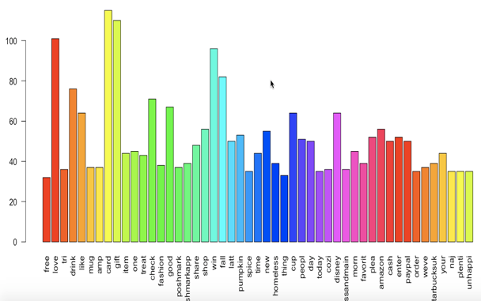
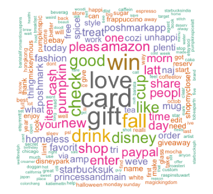
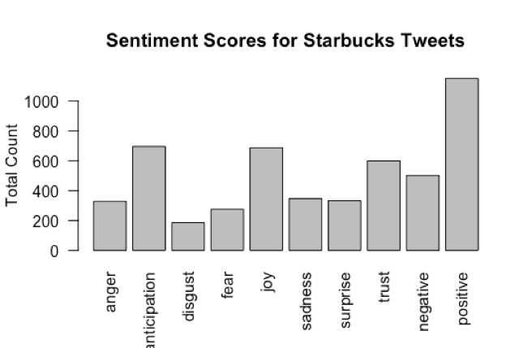
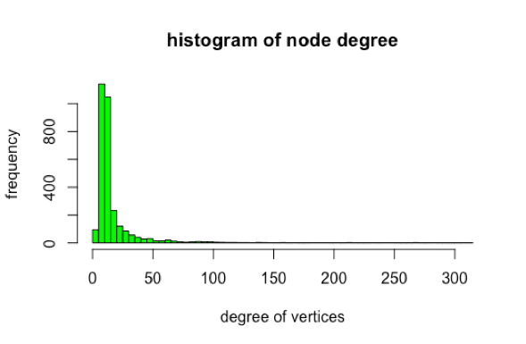
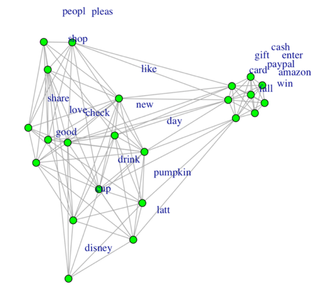
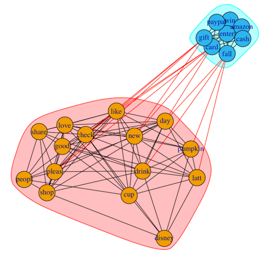
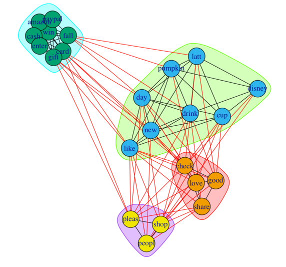
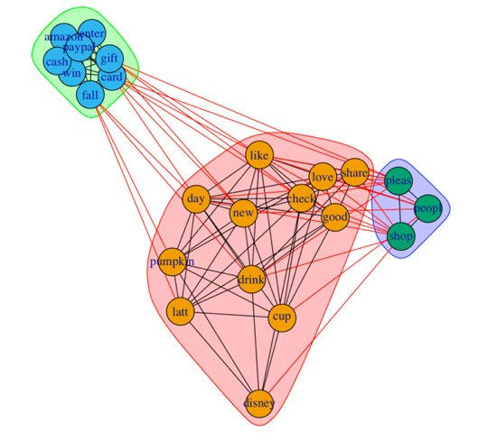
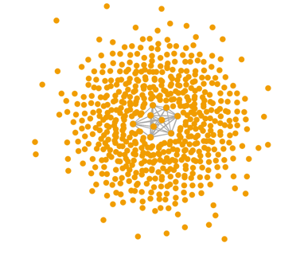
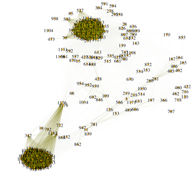

# Analyzing Social Media Marketing for Starbucks
> Ying Guo, Theodore Hector, Zhuoying Lin, Anirudh Reddy, Xiaoshi Zhu

## Part 1. Business understanding

With the intense competition in the food and beverages industry, it is important for companies to understand trends in consumer preferences and get timely feedbacks on products and services. We hope to provide companies with useful analysis for what customers are talking, how do they feel, and which aspects they can improve on. We chose Starbucks as our client company. As one of the world’s largest coffee brand, Starbucks has good popularity and reputation from a wide range of people. We would like to investigate its trending customer tweets and generate business insights from them. 

## Part 2. Data understanding and preparation
We extracted 1200 tweets through twitter API for sentiment and network analysis. The dataset contains 16 variables including text, whether someone favorited it, how many people favorited it, when it was created, id of person who tweeted, whether it is a retweet, etc.

The first step of our data preparation is building corpus. We removed the special characters in the text column and convert those text to utf-8 encoding. After that, we build our corpus for further analysis. Then we began to clean the data. Firstly, we converted all alphabet in the corpus to lower case. Secondly, we removed punctuations, numbers, URLs, stem words and white spaces because they’re not informative for our analysis. Additionally, we used the stop words function in English to exclude common words in English. Finally, we removed some words intuitively because they might be distracting if exist, such as “starbuck”, “starbucks”, “hey”, etc. The final step is to convert the cleaned dataset to term document matrix, which has 3038 terms in it.

## Part 3. Data Analysis

###### Word Frequency Analysis
We first made a frequency graph showing the count of appearances for each word. We found the most commonly used words are gift, card, love, win, fall, Paypal, disney, and cup. We already begin to see some positive feelings of people through the words such as love, like and good. Moreover, people are talking about gift cards and its seasonal products made of pumpkin spice. We investigated gift cards and found one tweet saying “Want to #win $50 in an #Amazon gift card, #Starbucks gift card, or #Paypal cash? Enter to win the Hello”. This suggests people use such gift cards or Paypal cash to launch promotions.

According to word frequency analysis, we have some reasons to believe that Starbucks gift cards and its seasonal pumpkin drinks are popular among people currently. Disney cups are new products Starbucks come up with, which might also explain its frequency here.

  

    
In addition, we can better visualize the information in a word cloud:

  

  
###### Sentiment Analysis

The overall sentiment from the tweets was a positive one. People seem to like Starbucks and its products. The positivity can also be explained by the anticipation for any new fall products/flavors that Starbucks introduced. An example of this positivity is a tweet stating "I don't usually like pumpkin spiced coffee. But the pumpkin cream cold brew from Starbucks is my new favorite thing” which has an anticipation score of 1, a joy score of 2, and a positive score of 2. Additionally, some of the negativity can be explained by tweets that contain negative sentiment words but are used in a positive way. 

  

###### Network Analysis 

Before doing the network analysis, we transposed the matrix and created a tweet adjacency matrix. We also created a histogram to show the degree for each nodes (words). We found that most words have degrees below 25, which means most words co-appear with other words for less than 25 times. 

  

a.	Centrality Measure: Degrees

We then limited our analysis to only terms having frequency more than 45. We found that words such as shop and love have high degrees, which makes sense because it can be together used with many other words. Words such as Disney have low degrees, because it can only be mentioned when people talk about a specific product, the Disney mug.

  

b.	Centrality Measure: Betweenness

This is a plot is showing the network analysis for the community detection using the betweenness. Different dense areas have different clusters.  The first cluster probably explains the sharing of positive feedback about the new pumpkin drink and Disney cup that the people are excited to shop. The second cluster of words probably explain tweets that want the people to enter contests to win Starbucks/amazon gift cards. Also, Starbucks accounts and cards can now be reloaded using PayPal online.

  

c.	Communities—Label Propagation

The label propagation gives four clusters. The first cluster is probably about promotion mentioned earlier; the second group is about new Disney cup and seasonal pumpkin latte and how people like them; the third one is about the 092satisfying shopping experience at the store and the fourth one is the tweets shared from an app call Poshmark. 

  

d.	Communities – Fast Greedy Method

We also tried fast greedy algorithm for clustering and got three clusters as shown in the graph. There’re two clusters show the similar results we got from label propagation. But the largest cluster here shows people’s general shopping experience in Starbucks while it was divided into two clusters in the last graph.

  

Among the four centrality methods, we believe Label Propagation method is the most reasonable analysis. All four methods clearly separate the promotion going on Twitter. The centrality shows which words have the most degree but can’t really tell us what the rest of the network talk about. When we dive into your data and check what people are sharing, most of the shares are generated from the Poshmark app. Only Label Propagation successfully catches that pattern. Therefore, Label Propagation has the better network quality.

e.	Connection among Tweets

In addition to network analysis for words, we also did network analysis for tweets. We made a histogram of degree and found that most of the tweets have zero degree, which means that they have no connection with others. And there’s a huge gap between 0 and 50 degrees. We can infer that those tweets with higher degree may be sent by some key opinion leaders or related to marketing campaigns.

  

Here, we see that most of the tweets have no connections/edges. Looking at only edges with at least 100 degree, we noticed that there are two cliques. This might suggest a close relationship within the group who posted these tweets. These people might share the same interests and tastes. We can potentially run a closeness analysis on these two group respectively and see if we can find anyone that are closer to the other people. If they are close to each other, the company can pick one individual from the group for promotions and the information can spread quickly among the group.
 
  |  
:--------------------------:|:-------------------------:
 
## Part 4. Conclusion

In our analysis, we found that people have an overall positive outlook towards Starbucks, and they are anticipating for the new products and drinks that are being launched by Starbucks. Also, there are various contests that are running for the people on twitter to win a gift cards to a Starbucks. Overall the people are very satisfied by the service and products. Additionally, some of the negative tweets may not be completely representative of the user’s true feelings on the subject.
However, it is important to keep in mind that our sample might be biased towards positive feelings. People are more likely to tweet if they are satisfied with the product and hope to share it with their friends. Therefore, out sample may be skewed and not representative of the overall population. We suggest the company to do further investigation such as give out surveys on streets randomly in addition to our analysis to better see the whole picture.
